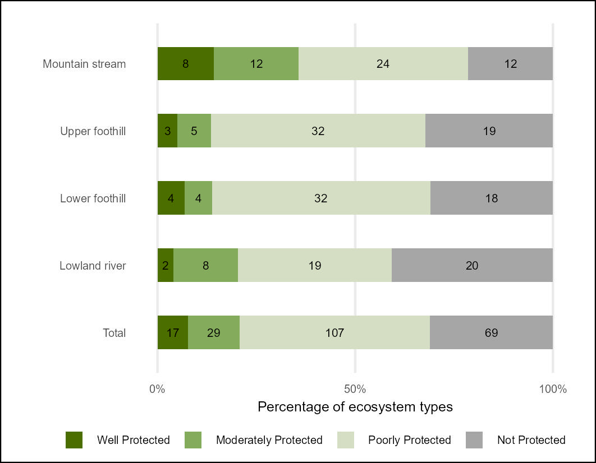
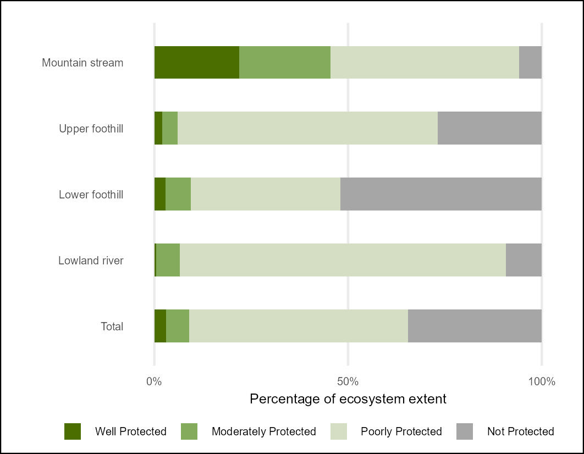

## **Workflows for undertaking the river Ecosystem Protection Level (EPL) assessment**

### **National Biodiversity Assessment - South Africa**

*South African National Biodiversity Institute (SANBI)*

June 2025

#### **Summary**

This repository contains a workflow that results in the NBA 2025 Ecosystem Protection Level indicators for River Ecosystems of South Africa following the methods of van [Deventer et al., 2019.](http://hdl.handle.net/20.500.12143/5847)

The Quarto document [Riv.EPL.qmd](Riv.EPL.qmd) describes the import of Protected Areas time series data - prepared in ARCPRO by SANBI - based on the South African Protected Areas Database (SAPAD) 2024Q4 (Department of Forestry Fisheries and Environment) and the import of the South African rivers database (v20250610) prepared by SANBI. The data were combined using the sf package in R and summarised using the tidyverse in R.

Protection Level is an indicator developed in South Africa that measures the representation of ecosystem types within the PA network. The extent of each ecosystem type within the PA network is expressed as a proportion of the total extent. Four classes of Ecosystem Protection Level which is calculated per ecosystem type (n=222).

-   Well Protected: 100% of the PA target within PA network; and only A&B condition rivers contribute

-   Moderately Protected: 50% to 99% of PA target within the PA network; and A&B condition rivers contribute 100%, C & D condition rivers contribute 30%, E & F condition rivers contribute 10%

-   Poorly Protected: 5% to 49% of PA target within the PA network; and A&B condition rivers contribute 100%, C & D condition rivers contribute 30%, E & F condition rivers contribute 10%

-   Not Protected: less than 5% of PA target within the PA network; and A&B condition rivers contribute 100%, C & D condition rivers contribute 30%, E & F condition rivers contribute 10%

The PA target was historically set at 20% for freshwater ecosystems, but with the adoption of the 30% targets for Target 3 of the Global Biodiversity Framework - the PA target was increased to 30% in the EPL calculations (previous time points (2018) were recalculated using this higher target). Ecosystem condition (based on Present Ecological State) data for each time point allows for only good condition river reaches to be considered representative for Well Protected status; while for MP PP and NP the condition of the rivers is used to calculate their contribution to meeting targets - higher integrity / condition rivers contribute more to meeting PA targets than low integrity / condition rivers.

#### Results:

Overall per-ecosystem type EPL results [epl_riv_metrics_per_type.csv](outputs/epl_riv_metrics_per_type.csv)

Summary table - count of river ecosystem types per slope zone per EPL category [epl24_riv_sum_count.csv](outputs/epl24_riv_sum_count.csv)

[epl24_riv_bar_plot_count.jpeg](outputs/epl24_riv_bar_plot_count.jpeg)

Summary table - extent of river per slope zone per EPL category [epl24_riv_sum_ext.csv](outputs/epl24_riv_sum_ext.csv) [epl24_riv_bar_plot_ext.jpeg](outputs/epl24_riv_bar_plot_ext.jpeg)

| EPL 2024 count  of types per category | EPL 2024 extent of types per category |
|----|----|
|  |  |

| Ecosystem Protection Level INDEX (change from 2018 to 2024)  |
|--------------------------------------------------------------|
|                          |
